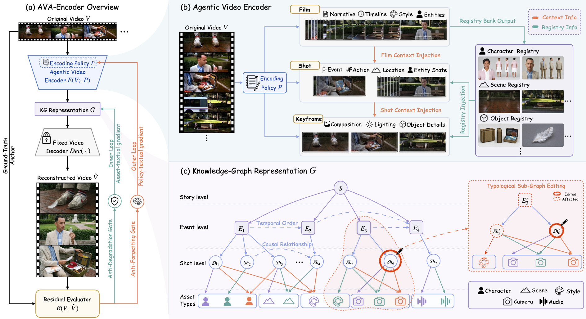
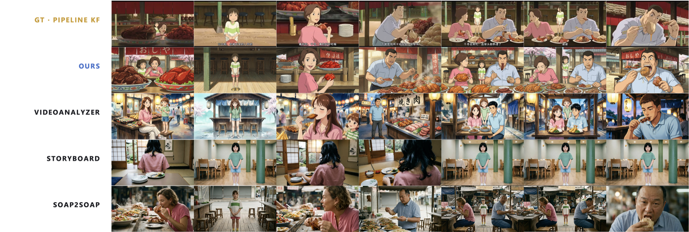
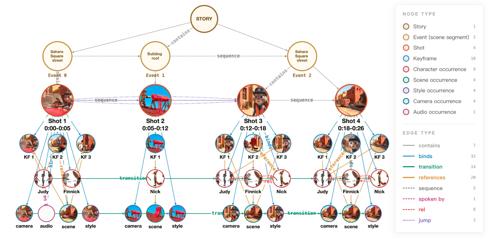
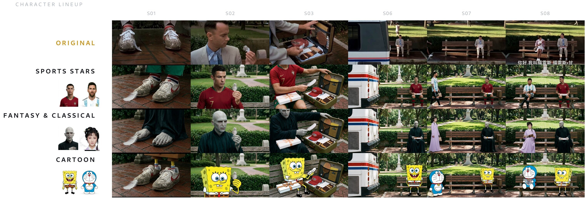
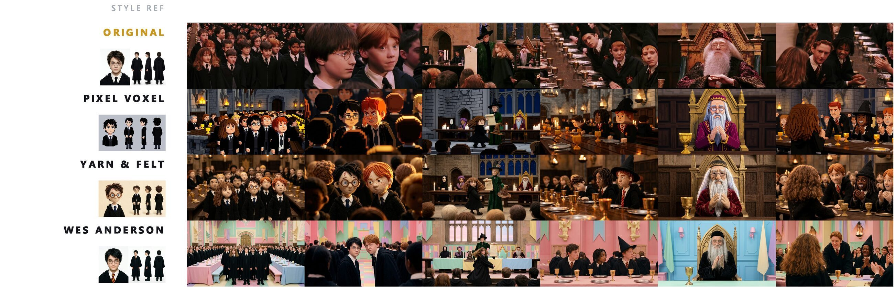

<div align="center">

# AVA-Encoder

### Towards Agent-Native Video Representation Learning

**Turning films into structured, editable, and cinematically faithful representations for creative agents.**

[](#paper)
[](#release-status)
[](#film-knowledge-graph-dataset)

Chuyue Li<sup>1,2</sup>, Jinpeng Yu<sup>1</sup>, Haozhe Wang<sup>1,3</sup>, Tian Xueyun<sup>1,4</sup>, Zhijing Zhang<sup>1,5</sup>, Bingnan Li<sup>1</sup>, Shuqi Gu<sup>2</sup>, Kan Ren<sup>2,*</sup>, Jiaming Liu<sup>1,*</sup>, Ruihua Huang<sup>1</sup>

<sup>1</sup>Qwen Business Unit of Alibaba &nbsp;&nbsp; <sup>2</sup>ShanghaiTech University  
<sup>3</sup>The Hong Kong University of Science and Technology  
<sup>4</sup>Institute of Computing Technology &nbsp;&nbsp; <sup>5</sup>Southeast University  
<sup>*</sup>Co-corresponding authors

**[Problem](#the-problem) · [Our Answer](#our-answer) · [Framework](#framework) · [Results](#main-results) · [Reconstruction](#qualitative-reconstruction) · [Editing](#agent-operable-film-knowledge-graph) · [Release](#release-status) · [Citation](#citation)**

</div>

> **In one sentence:** AVA-Encoder learns an agent-native, text-centered film knowledge graph by reconstructing the source film and using reconstruction errors to improve the shared encoding policy and each input-specific representation at separate stages.

## The Problem

### Films contain knowledge, but not in a form agents can directly use

Video creation agents can write stories, design keyframes, and generate videos, but their base models still lack the planning ability needed to coordinate scripts, characters, shots, and audiovisual elements into production-ready film content. One central reason is the scarcity of high-quality records of complete agentic video creation processes. Professionally directed films contain rich filmmaking knowledge, but agents cannot directly use the finished films as clear, step-by-step creation records.

This limitation leads to a fundamental mismatch: films encode narrative, visual, temporal, and audio information in a tightly connected multimodal form, whereas agents learn and operate most effectively through structured text, code, plans, and graphs.

| **Film space** | **Agent space** |
|:--|:--|
| Dense pixels, motion, sound, timing, and narrative are tightly connected. | Agents learn and operate through explicit text, plans, tools, and graphs. |
| The creative decisions behind a finished film are hidden in the final audiovisual output. | Reasoning, learning, querying, and editing require clear intermediate structure. |
| Existing visual representations retain detail but are hard to operate on; captions and understanding-oriented graphs are easier to read but often lose generation-critical information. | A useful representation must be readable, operable, and faithful at the same time. |

## Our Answer

### Agentic video auto-encoding

**AVA-Encoder** converts a film into a text-centered film-creation knowledge-graph (KG) representation, reconstructs the film from that representation through a fixed decoder, and uses the observed reconstruction errors to improve the representation process. Following the paper notation, the core auto-encoding path is

$$
G = E(V;P), \qquad \hat V = \mathrm{Dec}(G),
$$

where $V$ is the input film, $P=(P_{\mathrm{film}},P_{\mathrm{shot}},P_{\mathrm{kf}})$ is the complete Agentic Video Encoder policy, $G$ is the resulting KG representation, and $\hat V$ is the reconstructed video. The fixed decoder $\mathrm{Dec}$ consists of a fixed text-to-image model followed by a fixed image-to-video model.

<p align="center">
  
</p>

The resulting representation is designed to be:

- **Agent-readable:** cinematic information is stored as clear, structured text.
- **Agent-operable:** agents can query, learn from, and edit individual nodes and their dependencies.
- **Cinematically faithful:** reconstruction-based learning preserves the information needed to regenerate the source film.

## What This Work Shows

| **1 · Faithful representation** | **2 · Self-evolving encoding** | **3 · Operable film knowledge** |
|:--|:--|:--|
| Reconstruction directly tests whether a representation preserves enough cinematic information for future generation. AVA-Encoder reaches **49.0% Overall**, outperforming the strongest external baseline by **20.7 points**. | Two stage-separated textual-gradient loops improve different objects at different times: the outer stage updates the shared shot-level policy, and optional test-time refinement updates only the current input's KG. Together they add **6.6 points** over removing both stages. | Typed KG relations make film knowledge directly queryable and editable. A local change can update dependent identities, actions, dialogue, keyframes, and shots while preserving unrelated content. |

## Why Reconstruction?

Downstream understanding tasks may succeed even when a representation has discarded visual composition, camera language, motion, timing, or audio details needed for creation. AVA-Encoder instead asks a stricter question: **can the representation reconstruct the source film?** With the decoder fixed, reconstruction differences reveal which information was lost or changed and provide grounded feedback for self-improvement.

## Framework

AVA-Encoder contains four connected components:

1. **Multi-level Agentic Video Encoder.** Film-, shot-, and keyframe-level understanding progressively maps dense video content into structured text while passing high-level context to finer levels.
2. **Film Knowledge-Graph Representation.** A Story–Event–Shot hierarchy and Character, Scene, Object, Style, Camera, and Audio states separate cinematic information into editable text nodes. Typed edges preserve hierarchy, temporal order, asset references, and cross-shot dependencies.
3. **Dual-loop Textual-Gradient Evolution.** Data-Independent Encoding Policy Pseudo-Training first improves the shared shot-level Agentic Video Encoder policy $P_{\mathrm{shot}}$ across videos before deployment. After the complete policy is frozen, optional Data-Dependent KG Representation Refinement improves only the current input's $G$ at test time. All foundation-model weights remain fixed, and the two stages never update $P$ and $G$ simultaneously.
4. **Reconstruction Error.** The loop-facing $R_{\mathrm{reward}}$ diagnoses reconstruction failures and accepts or rejects candidate updates. The separate $R_{\mathrm{eval}}$ provides the common four-direction final evaluation across representation systems and is not used to optimize either loop.

The Story–Event–Shot hierarchy and its Character, Scene, Object, Style, Camera, and Audio states contain structured text only. Generated keyframes and other image, audio, and video outputs are kept in a linked asset layer. No frame, crop, or screenshot from the source video is stored as an asset or supplied directly to the reconstruction generators.

Final reporting under $R_{\mathrm{eval}}$ uses direct Video comparison (V), direct Keyframe comparison (KF), Video Back-Captioning (V-BC), and Keyframe Back-Captioning (KF-BC). These directions cover Character, Scene, Position, Motion, Audio, Style, Camera, and Narrative; Audio is not applicable to the keyframe directions.

## Main Results

AVA-Encoder achieves the best reconstruction accuracy in all four comparison directions.

| Method | Video ↑ | Keyframe ↑ | Video Back-Captioning ↑ | Keyframe Back-Captioning ↑ | Overall ↑ |
|:--|--:|--:|--:|--:|--:|
| VideoAnalyzer | 26.1 | 28.5 | 9.7 | 21.7 | 21.5 |
| Storyboard Studio | 16.4 | 28.6 | 9.6 | 23.0 | 19.4 |
| soap2soap | 36.7 | 39.5 | 15.8 | 21.3 | 28.3 |
| **AVA-Encoder** | **57.8** | **73.7** | **29.7** | **34.6** | **49.0** |

All values are percentages. Overall is the unweighted mean of the four comparison directions.

Key findings:

- **+20.7 percentage points** over the strongest external baseline in Overall reconstruction accuracy.
- **+6.6 percentage points** over removing both optimization stages, equivalent to a **15.6% relative improvement**.
- In a controlled policy-only comparison, the pseudo-trained Agentic Video Encoder reaches **45.8%**, compared with **44.4%** for a carefully human-tuned policy.
- The pseudo-trained policy uses **74.3% fewer system-prompt tokens** than the human-tuned policy.
- The automatic reconstruction metrics agree with the judgments of two mutually blinded expert annotators on **710 of 730 comparison triples (97.3%)**.

## Qualitative Reconstruction

<p align="center">
  
</p>

AVA-Encoder better preserves character identity, scene content, actions, composition, and temporal consistency when reconstructing a film from its representation.

## Agent-Operable Film Knowledge Graph

<p align="center">
  
</p>

Typed graph relations connect narrative structure, recurring entities, cinematic states, keyframes, and generated assets. These links allow an agent to trace dependencies and update affected content without rewriting unrelated parts of the film.

### Linked identity editing

<p align="center">
  
</p>

An identity edit can update the dependent character appearance, actions, dialogue, keyframes, and shots while preserving unrelated characters, scenes, compositions, and events.

### Linked visual-treatment editing

<p align="center">
  
</p>

A visual-treatment edit follows the corresponding style states and asset references, producing a consistent change across linked shots.

## Film Knowledge Graph Dataset

We are preparing a Film Knowledge Graph Dataset at the scale of tens of thousands of shots. It contains text-based Film KG representations with fine-grained structured descriptions of scripts, events, characters, scenes, objects, shots, keyframes, camera language, visual style, and audio.

The public dataset will contain the structured-text hierarchy, states, and graph relations rather than source-film pixels or generated multimedia assets. Users will be able to connect their own image-, audio-, and video-generation APIs, use the representations as agentic video creation trajectories, or perform linked graph editing without first rendering a video.

## Release Status

> [!IMPORTANT]
> **Code is coming soon.** We are preparing the implementation, evaluation toolkit, system prompts, data documentation, and graph-editing interface for public release in this repository.

- [x] Paper overview and method description
- [x] Reconstruction and editing visualizations
- [ ] AVA-Encoder implementation — **Coming Soon**
- [ ] Reconstruction evaluation toolkit — **Coming Soon**
- [ ] System prompts and reproducibility instructions — **Coming Soon**
- [ ] Film Knowledge Graph Dataset — **Coming Soon**
- [ ] Graph-editing interface — **Coming Soon**

Please watch or star this repository to follow future releases.

## Paper

**AVA-Encoder: Towards Agent-Native Video Representation Learning**

The public paper link will be added here when available.

## Citation

If you find this project useful, please consider citing our paper:

```bibtex
@misc{li2026avaencoder,
  title  = {AVA-Encoder: Towards Agent-Native Video Representation Learning},
  author = {Chuyue Li and Jinpeng Yu and Haozhe Wang and Tian Xueyun and
            Zhijing Zhang and Bingnan Li and Shuqi Gu and Kan Ren and
            Jiaming Liu and Ruihua Huang},
  year   = {2026}
}
```

## License

Licenses for the code, evaluation toolkit, and Film Knowledge Graph Dataset will be provided with their respective releases. The current repository contains the project description and paper visualizations only.

## Contact

For questions and collaboration, please contact:

- Jiaming Liu: [jmliu1217@gmail.com](mailto:jmliu1217@gmail.com)
- Kan Ren: [renkan@shanghaitech.edu.cn](mailto:renkan@shanghaitech.edu.cn)
